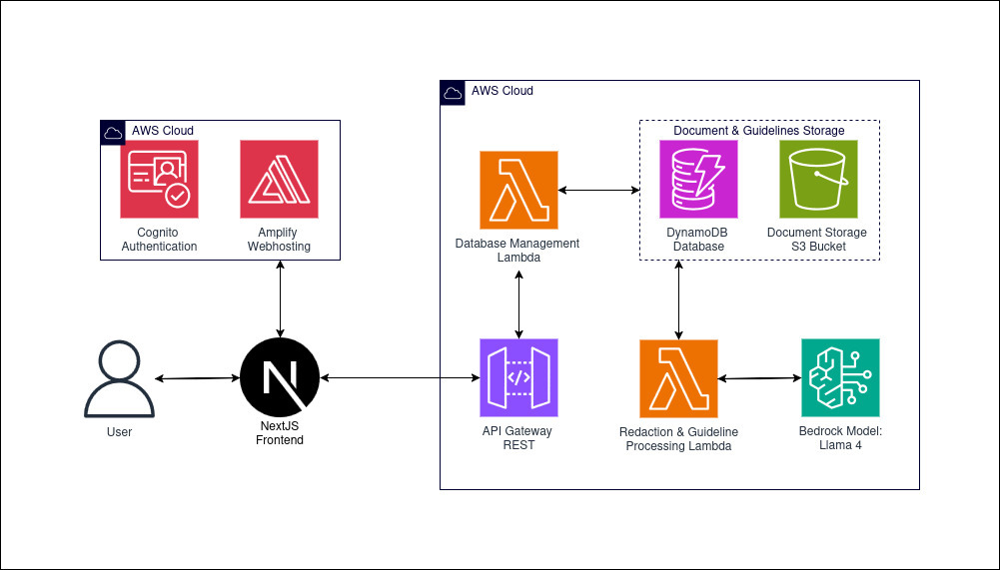

# Tucson PD - Automated Document Redaction System

An AI-powered document redaction system for the Tucson Police Department that automatically identifies and applies redactions to scanned police documents based on configurable guidelines. The system uses Amazon Nova Pro for semantic analysis to determine what must be redacted.

## Disclaimers

Customers are responsible for making their own independent assessment of the information in this document.

This document:

(a) is for informational purposes only,

(b) references AWS product offerings and practices, which are subject to change without notice,

(c) does not create any commitments or assurances from AWS and its affiliates, suppliers or licensors. AWS products or services are provided "as is" without warranties, representations, or conditions of any kind, whether express or implied. The responsibilities and liabilities of AWS to its customers are controlled by AWS agreements, and this document is not part of, nor does it modify, any agreement between AWS and its customers, and

(d) is not to be considered a recommendation or viewpoint of AWS.

Additionally, you are solely responsible for testing, security and optimizing all code and assets on GitHub repo, and all such code and assets should be considered:

(a) as-is and without warranties or representations of any kind,

(b) not suitable for production environments, or on production or other critical data, and

(c) to include shortcuts in order to support rapid prototyping such as, but not limited to, relaxed authentication and authorization and a lack of strict adherence to security best practices.

All work produced is open source. More information can be found in the GitHub repo.

## Table of Contents

- [Features](#features)
- [Architecture Overview](#architecture-overview)
- [How It Works](#how-it-works)
- [Project Structure](#project-structure)
- [Backend Integration](#backend-integration)
- [Deployment](#deployment)
- [API Reference](#api-reference)
- [Guidelines Management](#guidelines-management)
- [User Guide](#user-guide)
- [Stack Management](#stack-management)

## Features

### Automated Redaction Processing
- **OCR Text Extraction**: Tesseract-based OCR extracts all text with precise bounding boxes from scanned documents
- **AI-Powered Semantic Analysis**: Amazon Nova Pro identifies what must be redacted based on configurable guideline rules
- **Cross-Page Consistency**: Entity index tracks names, identifiers, and PII across all pages to ensure consistent redaction
- **Parallel Processing**: Concurrent Nova API calls for faster processing of multi-page documents
- **Human Review Workflow**: AI proposes redactions, reviewers approve or edit before final application
- **Permanent Redaction**: PyMuPDF applies redactions that permanently destroy underlying content — not visual overlays

### Guidelines Management
- **PDF-to-JSON Conversion**: Upload redaction guideline PDFs and automatically convert them to structured rule sets
- **Rule-Based Configuration**: Each rule specifies what to redact, who it applies to, conditions, and exceptions
- **Version Management**: Activate, deactivate, and update guidelines independently of case processing

### Case Management
- **Full Lifecycle Tracking**: Cases progress through defined statuses from upload to completion
- **S3-Based Storage**: All documents (unredacted, proposals, edited, redacted) stored securely in S3
- **DynamoDB Metadata**: Case status, processing metadata, and error tracking in DynamoDB
- **Presigned URL Access**: Secure document upload and download via presigned S3 URLs

## Architecture Overview

### System Architecture



The application uses a serverless architecture on AWS:

- **Frontend**: React application (separate repository)
- **API Layer**: REST API Gateway with Lambda proxy integration
- **Database Lambda**: Handles all API operations — case CRUD, guideline management, presigned URLs, and triggers Bedrock processing
- **Bedrock Lambda**: Performs document processing — OCR extraction, Nova Pro analysis, and redaction application
- **Storage**: S3 for documents, DynamoDB for case and guideline metadata
- **AI/ML**: Amazon Nova Pro via Bedrock Converse API for semantic analysis, Tesseract OCR for text extraction

### Why This Architecture?

- **Split OCR + Semantic Analysis**: OCR provides pixel-precise text locations while Nova Pro focuses purely on semantic understanding of what to redact — each tool does what it's best at
- **Human-in-the-Loop**: AI proposes, humans approve — critical for legal compliance in law enforcement document handling
- **Serverless**: Lambda functions scale to demand with no idle infrastructure costs
- **Configurable Guidelines**: Redaction rules can be updated without code changes by uploading new guideline PDFs
- **Permanent Redaction**: PyMuPDF's `apply_redactions()` destroys underlying content, meeting legal standards for document redaction

## How It Works

### Redaction Processing Pipeline

1. **Upload**: Scanned police document (PDF) is uploaded to S3 via presigned URL
2. **OCR Extraction**: Tesseract extracts all text from every page with word-level bounding boxes in PDF point coordinates
3. **Entity Indexing**: Cross-page index identifies recurring names, phone numbers, SSNs, and other PII patterns across the document
4. **Document Summary**: Nova Pro generates a summary from page 1 to provide context for per-page analysis
5. **Semantic Analysis**: Nova Pro receives each page's OCR text map (not the image) plus guidelines, entity index, and document summary — identifies which text blocks to redact and which rules justify each redaction
6. **Coordinate Resolution**: Bounding boxes are resolved from OCR output (not estimated by the AI), with fuzzy text matching as fallback
7. **Human Review**: Redaction proposals are presented in the frontend for review and editing
8. **Application**: Approved redactions are permanently applied to the PDF using PyMuPDF black rectangles

### Case Lifecycle

```
CASE_CREATED → UNREDACTED_UPLOADED → PROCESSING → REVIEW_READY → REVIEWING → APPLYING_REDACTIONS → COMPLETED
```

If processing fails, the status reverts to allow retry:
- `PROCESSING` failure → reverts to `UNREDACTED_UPLOADED`
- `APPLYING_REDACTIONS` failure → reverts to `REVIEWING`

## Project Structure

```
TucsonPD/
├── .gitignore
├── README.md
├── setup.sh                                    # Main deployment orchestration script
├── frontend_build.sh                           # Frontend build automation script
│
├── tucson-pd-backend/                          # Backend CDK Stack
│   ├── app.py                                  # CDK app entry point
│   ├── cdk.json                                # CDK configuration
│   ├── requirements.txt                        # Python dependencies
│   │
│   ├── tucson_pd_backend/
│   │   ├── __init__.py
│   │   └── tucson_pd_backend_stack.py          # Infrastructure definition (CDK)
│   │       # Creates: DynamoDB tables, S3 bucket, Lambda functions,
│   │       #          Lambda layers, API Gateway, IAM roles
│   │
│   └── lambdas/
│       ├── bedrock_lambda/                     # Document processing Lambda
│       │   ├── lambda_function.py              # Main handler — routes process/apply/convert actions
│       │   ├── process_document.py             # OCR extraction → Nova analysis → bbox resolution
│       │   ├── apply_redactions.py             # Applies permanent black-box redactions to PDF
│       │   ├── convert_guidelines.py           # Converts guideline PDFs to structured JSON rules
│       │   ├── ocr_extraction.py               # Tesseract OCR with word-level bounding boxes
│       │   ├── utils.py                        # AWS service helpers (S3, DynamoDB, Bedrock)
│       │   ├── bedrock_config.py               # Model IDs, temperatures, prompt retrieval
│       │   ├── constants.py                    # Environment variables and configuration
│       │   └── prompts/
│       │       ├── document_summary.py         # Prompt for document summarization
│       │       ├── page_analysis.py            # Prompt for per-page redaction identification
│       │       ├── guidelines_conversion.py    # Prompt for PDF-to-JSON guideline conversion
│       │       └── error.py                    # Fallback error prompt
│       │
│       ├── database_management_lambda/         # API operations Lambda
│       │   └── lambda_function.py              # Case CRUD, guidelines, presigned URLs
│       │
│       └── layers/
│           ├── pdf-processing-layer.zip        # PyMuPDF and pdfplumber
│           └── tesseract-ocr-layer.zip         # Tesseract binary + English language data
│
└── tucson-pd-frontend/                         # Frontend CDK Stack
    ├── app.py                                  # CDK app entry point
    ├── cdk.json                                # CDK configuration
    ├── requirements.txt                        # Python dependencies
    ├── build.zip                               # Generated by frontend_build.sh (gitignored)
    │
    ├── tucson_pd_frontend/
    │   ├── __init__.py
    │   └── tucson_pd_frontend_stack.py         # Frontend infrastructure definition
    │
    ├── lambdas/
    │   ├── amplify_deployment_lambda/          # Amplify deployment automation
    │   ├── create_admin_user_lambda/           # Admin user creation
    │   └── post_confirmation_lambda/           # Post-signup confirmation
    │
    └── frontend/                               # React application
        └── ...                                 # Frontend source code
```

## Backend Integration

The application uses a REST API Gateway with Lambda proxy integration. All API operations are handled by the Database Management Lambda, which triggers the Bedrock Lambda for processing tasks.

### API Base URL

After deployment, the API endpoint is available in the CDK stack outputs as `ApiGatewayUrl`.

```
https://{api-id}.execute-api.{region}.amazonaws.com/prod/
```

### Request Flow

```
Frontend → API Gateway → Database Lambda → (DynamoDB / S3 / Bedrock Lambda)
```

For document processing, the Database Lambda invokes the Bedrock Lambda asynchronously and returns immediately. The Bedrock Lambda updates DynamoDB status as it progresses, which the frontend can poll.

## Deployment

### Prerequisites

Ensure you have access to the Nova Pro LLM model in your AWS account and permissions to deploy resources.

**Required AWS Services Access**:
- Amazon Bedrock (Nova Pro model: `us.amazon.nova-pro-v1:0`)
- AWS Lambda
- Amazon S3
- Amazon DynamoDB
- Amazon API Gateway
- AWS IAM

**Network Configuration**:
- Default VPC available in your AWS region
- If default VPC doesn't exist, create using: [AWS VPC Documentation](https://docs.aws.amazon.com/cli/latest/reference/ec2/create-default-vpc.html)

### EC2 Instance Setup

1. **Navigate to EC2 Console**
   - Log into your AWS Console
   - Search for "EC2" in the services search bar
   - Click on "EC2" under Services

2. **Launch Instance**
   - Click "Launch Instance" button
   - Configure instance settings:
     - Name: "TucsonPD-Deployment"
     - AMI: Amazon Linux 2023
     - Instance type: t2.micro (or larger)
     - Use default VPC configuration
   - Click "Launch Instance"
   - Wait for instance to reach "running" state

3. **Connect to Instance**
   - Navigate to the Instances page
   - Select your created instance
   - Click "Connect"
   - Use EC2 Instance Connect or SSH with username: `ec2-user`

> **Note**: Save your instance details for future management operations. This instance will be needed for updates and stack deletion.

### Install Required Packages

Execute the following commands in your EC2 terminal:

> **Note**: When password prompts appear, press Enter. Use Ctrl+Shift+V for terminal paste operations.

1. **Install Git and Node.js**
   ```bash
   sudo yum install -y git nodejs
   ```

2. **Install AWS CDK**
   ```bash
   npm install -g aws-cdk
   ```

3. **Install Python dependencies**
   ```bash
   pip install aws-cdk-lib constructs
   ```

4. **Verify Installations**
   ```bash
   git --version
   cdk --version
   python3 --version
   ```

### Deployment Steps

1. **Clone the repository**:
   ```bash
   git clone https://github.com/ASUCICREPO/TucsonPD
   ```

2. **Navigate to the project directory**:
   ```bash
   cd TucsonPD
   ```

3. **Make the setup script executable**:
   ```bash
   chmod +x setup.sh
   ```

4. **Run the deployment script**:
   ```bash
   ./setup.sh deploy
   ```

5. **Enter your preferred admin email and password**

6. **Wait for the system to be deployed** (may take up to 30 minutes)

7. **View the application** at the deployed Amplify link, which can be found in the Amplify console page

8. **Stop the EC2 Instance**
   - Exit the EC2 instance
   - Navigate to EC2 console
   - Select your instance
   - Click "Instance state" → "Stop instance"

> **Important**: Keep the EC2 instance for future deployment management, updates, and deletion operations. Do not terminate the instance.

## API Reference

### Cases

| Method | Endpoint | Description |
|--------|----------|-------------|
| `POST` | `/cases` | Create a new case |
| `GET` | `/cases` | List all cases |
| `GET` | `/cases/{case_id}` | Get case details |
| `DELETE` | `/cases/{case_id}` | Delete a case |
| `PUT` | `/cases/{case_id}/status` | Update case status |
| `PUT` | `/cases/{case_id}/s3-path` | Update S3 paths |

### Presigned URLs

| Method | Endpoint | Description |
|--------|----------|-------------|
| `POST` | `/presigned-url/upload` | Get presigned URL for document upload |
| `POST` | `/presigned-url/download` | Get presigned URL for document download |

### Guidelines

| Method | Endpoint | Description |
|--------|----------|-------------|
| `POST` | `/guidelines/upload` | Upload a new guideline PDF |
| `GET` | `/guidelines/all` | List all guidelines |
| `GET` | `/guidelines/active` | Get the active guideline |
| `PUT` | `/guidelines/{guideline_id}` | Update guideline JSON |
| `DELETE` | `/guidelines/{guideline_id}` | Delete a guideline |
| `POST` | `/guidelines/{guideline_id}/process` | Convert guideline PDF to JSON |
| `PUT` | `/guidelines/{guideline_id}/activate` | Activate a guideline |
| `GET` | `/guidelines/{guideline_id}/rules` | Get guideline rules JSON |
| `GET` | `/guidelines/{guideline_id}/document` | Get presigned URL for guideline PDF |

## Guidelines Management

### Guideline Rule Structure

Each guideline PDF is converted to a JSON rule set with this structure:

```json
{
  "version": "1.0",
  "rules": [
    {
      "id": 1,
      "description": "Redact victim name, DOB, SSN, and DL number per ARS 13-4434",
      "applies_to": ["victim_adult"],
      "conditions": ["all cases"],
      "exceptions": ["Victim provides signed notarized request form"]
    }
  ]
}
```

### Role Vocabulary for `applies_to`

| Value | Description |
|-------|-------------|
| `all` | Applies regardless of role |
| `victim_adult` | Adult victims |
| `victim_juvenile` | Juvenile victims |
| `victim_sexual_assault` | Sexual assault victims |
| `witness_adult` | Adult witnesses |
| `witness_juvenile` | Juvenile witnesses |
| `suspect_adult` | Adult suspects |
| `suspect_juvenile` | Juvenile suspects |
| `arrestee_adult` | Adult arrestees |
| `arrestee_juvenile` | Juvenile arrestees |
| `government_employee` | Government employees |
| `confidential_informant` | Confidential informants |
| `undercover_officer` | Undercover officers |

### Guideline Lifecycle

```
Upload PDF → Process (convert to JSON) → Review rules → Activate
```

Only one guideline can be active at a time. Activating a new guideline automatically deactivates the previous one.

## User Guide

### Processing a Document

1. **Create a Case**: Create a new case in the system with relevant metadata
2. **Upload Document**: Upload the scanned police document PDF via presigned URL
3. **Ensure Active Guideline**: Verify an active guideline exists (the system will fail with a clear error if not)
4. **Trigger Processing**: Initiate document processing — the system will OCR the document, analyze each page, and generate redaction proposals
5. **Review Proposals**: Review the AI-generated redaction proposals in the frontend — each proposal shows the text to redact, the justifying rules, and the bounding box location
6. **Edit if Needed**: Add missed redactions, remove false positives, or adjust bounding boxes
7. **Apply Redactions**: Submit approved redactions — the system permanently applies black boxes to the PDF
8. **Download Result**: Download the final redacted document

### Managing Guidelines

1. **Upload**: Upload a redaction guidelines PDF (e.g., department policy document)
2. **Process**: Trigger PDF-to-JSON conversion — Nova Pro extracts structured rules
3. **Review**: Inspect the generated rules for accuracy and completeness
4. **Edit**: Modify rules if needed via the API
5. **Activate**: Set the guideline as active for document processing

## Stack Management

### How to Delete the Stack

1. **Start EC2 Instance**
   - Navigate to EC2 console in AWS
   - Select the "TucsonPD-Deployment" instance
   - Click "Instance state" → "Start instance"
   - Wait for instance to reach "running" state

2. **Connect to Instance**
   - Select your instance
   - Click "Connect"
   - Use EC2 Instance Connect

3. **Navigate to Project Directory**
   ```bash
   cd TucsonPD
   ```

4. **Run Destroy Script**
   ```bash
   ./setup.sh destroy
   ```
   - Confirm deletion when prompted
   - Wait for stack deletion to complete

5. **Manual Cleanup (if needed)**
   - Navigate to S3 console and delete the redaction bucket if it wasn't automatically removed
   - Navigate to Amplify console and delete the application if it wasn't automatically removed
   - Check DynamoDB console for any remaining tables

6. **Stop or Terminate EC2 Instance**
   - Once deletion is complete, you can terminate the EC2 instance
   - Navigate to EC2 console → Select instance → "Instance state" → "Terminate instance"

> **Note**: The destroy process removes Lambda functions, API Gateway, S3 buckets, DynamoDB tables, and related resources. S3 buckets with versioned objects may require manual deletion.

### How to Update (Note: please save any data before the update as it will not be preserved)

1. **Start EC2 Instance**
   - Restart the "TucsonPD-Deployment" instance
   - Connect using EC2 Instance Connect

2. **Navigate to Project Directory**
   ```bash
   cd TucsonPD
   ```

3. **Pull Latest Changes**
   ```bash
   git pull
   ```

4. **Redeploy with Updates**
   ```bash
   ./setup.sh destroy
   ./setup.sh deploy
   ```

5. **Stop EC2 Instance**
   - Exit and stop the instance when complete

> **Important**: Always maintain the EC2 instance for future updates and management. Terminating it will require a new instance setup for future operations.